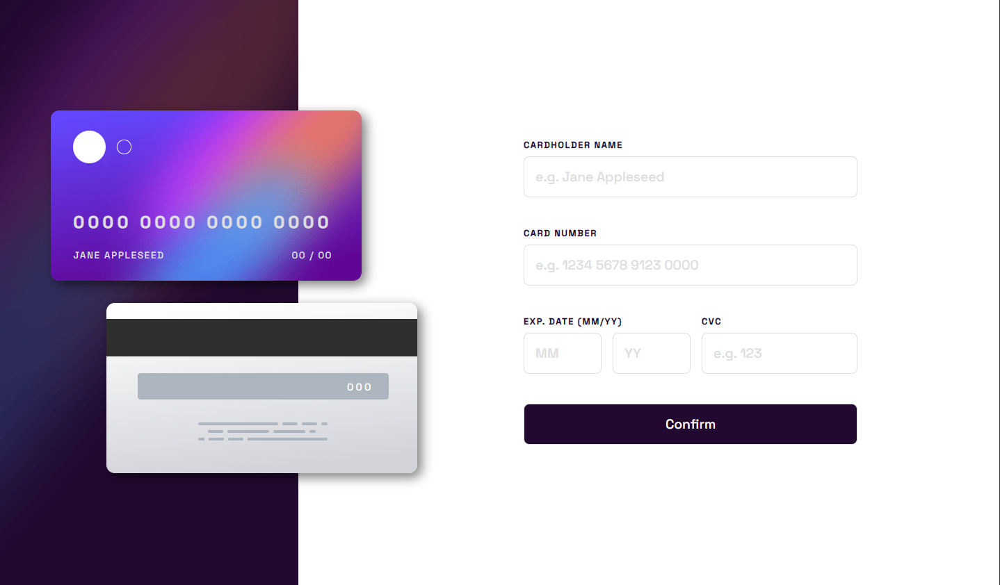
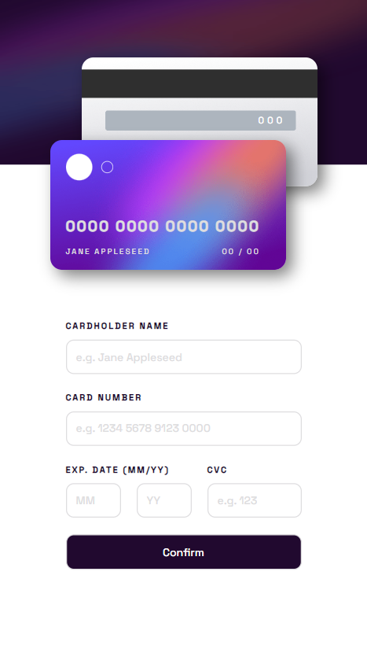

# Interactive Card Details Form

*Caption: Desktop view of the Interactive Card Details Form*

*Caption: Mobile view of the Interactive Card Details Form*

I created an **Interactive Card Details Form** as part of the [Frontend Mentor](https://www.frontendmentor.io/challenges/interactive-card-details-form-XpS8cKZDWw) challenge. This project provides users with a stylish layout for entering card details. It includes a range of interactive elements, such as real-time card detail updates as the user types. The form also includes validation to ensure data is entered correctly.

## Link

You can see a live demo of the **Interactive Card Details Form** [here](https://lawrpunk.github.io/interactive-card-details/).

## Features

- Responsive design for any screen size.
- Form validation to check for empty fields and correct formats.
- Interactive elements, including hover effects and real-time card detail updates.

## Technologies Used

- HTML
- CSS
- JavaScript

## Acknowledgments

- [Frontend Mentor](https://www.frontendmentor.io/) for the challenge
